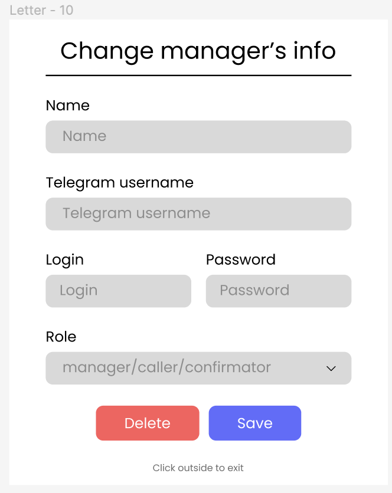

# Адміністратор
**Адміністратор** - це керівник відділу індивідуальних консультацій чи тім лід команди менеджерів індивідуальних консультацій.  

**Адміністратор** - має власний інтерфейс, на який заходить за адресою /administrator/:id , де :id ідентифікатор адмінітратора в базі даних.

У Адміністратора є основні функції: створення та редагування користувачів, управління курсами, управління групаи по курсах, контроль та корегування дій всіх спеціалістів.

  

  

  

  POST /register_manager

  

## CRUD курсів.

  

  

  

GET /courses

POST /register_course

DELETE /remove_course/{int:element_id}

PUT /update_course/{int:element_id}

## CRUD Груп курсів.