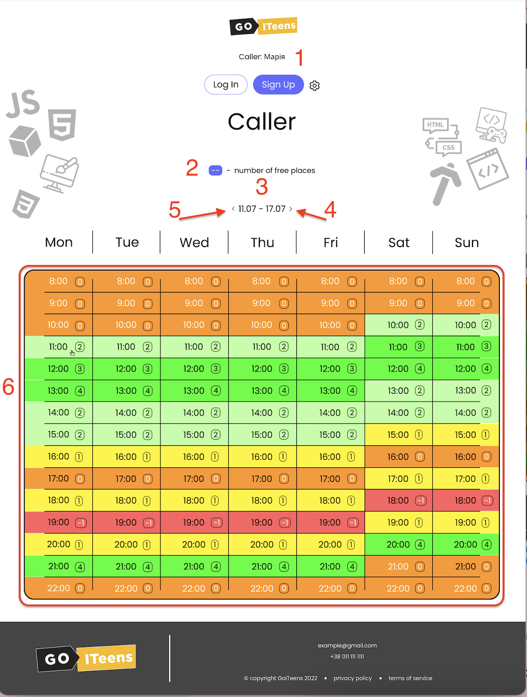

1. Роль та ім'я користувача.
2. Текст з описом.
3. Тиждень із яким на даний момент працює користувач. За замовчуванням - дані отримаємо з бекенду.
4. При натисканні кнопка активним стає наступний тиждень.
5. При натисканні кнопка активним стає попередній тиждень.
6. Робоче поле: колір визначаєтсья наявністю вільних слотів на певний час. При кліку на будь-яку комірку - з'являється вікно.  
  
