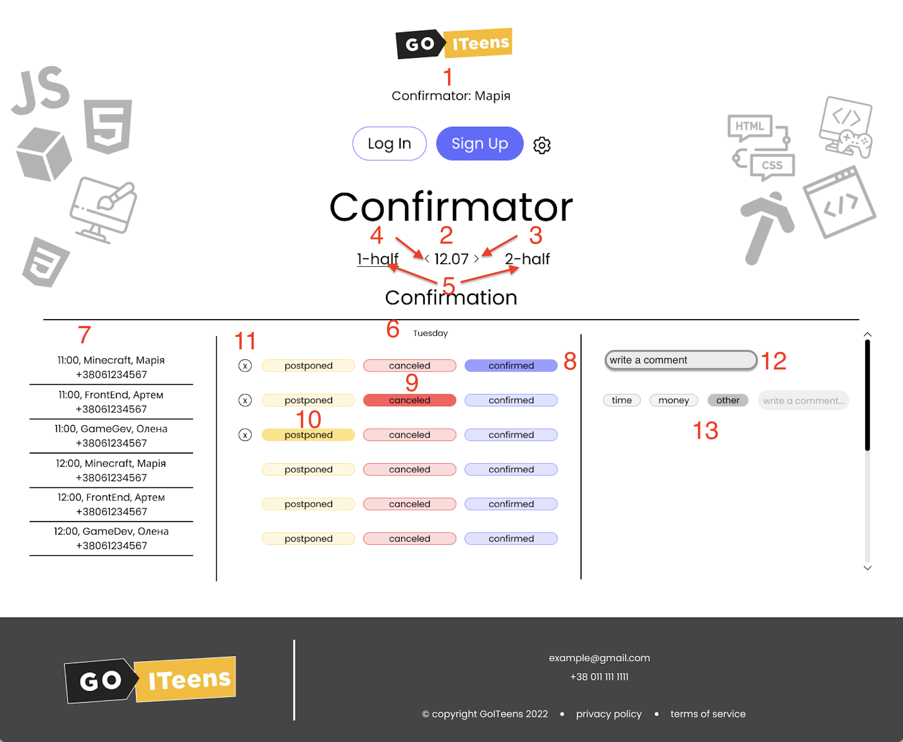

1. Вивід ролі та імені менеджера, що на даний момент працює зі сторінкою.
2. Тиждень із яким на даний момент працює користувач. За замовчуванням - дані отримаємо з бекенду.
3. При натисканні кнопка активним стає наступний тиждень.
4. При натисканні кнопка активним стає попередній тиждень.
5. При натисканні 1-st half відпріляється запит на отримання переліку консультацій в першій половині дня, 2-st half - в другій половині дня.
6. День тижня.
7. Перелік всіх властивостей консультації, яка буде планується до підтвердження.
8. При натисканні кнопки Confirmed - відправляється запит про те, що пристуність клієнта на консультації підтверджено. При натсканні з'являється поле для коменту (12).
9. При натисканні кнопки Canceled - відправляється запит про те, що консультацію скасовано. При натисканні з'являється поле для фіксації типу відміну та коменту (13).
10. При натисканні кнопки postponded - відкривається вікно, в якому конфірматор може обрати новий час проведення консультації.

11. При натисканні хрестика - відпрвіляється запит про те, що статус консультації стає "не підтверджено" (необхідно для виправлення помилок).
12. Поле для введення повідомлення, яке відправляється при події втрати фокусу.
13. Поле для введення типу скасування консультації та поле для введення повідомлення. Запит про тип скасування консульатції відпрвляється при натисканні кнопки. Повідомлення, яке відправляється при події втрати фокусу.