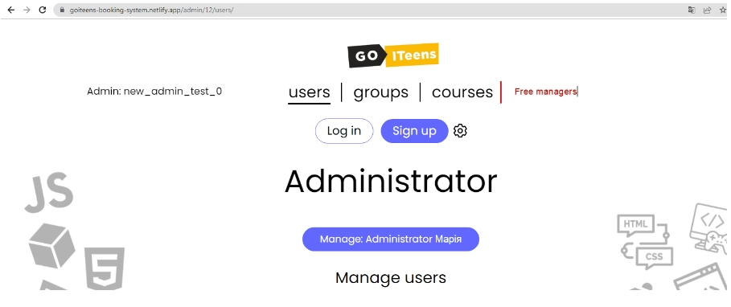
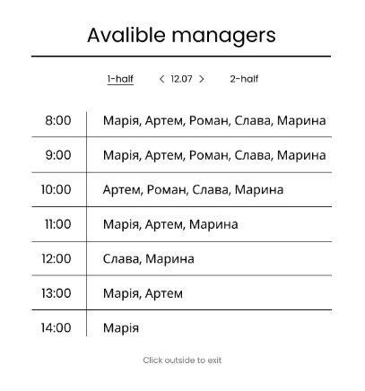
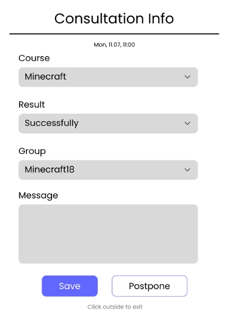
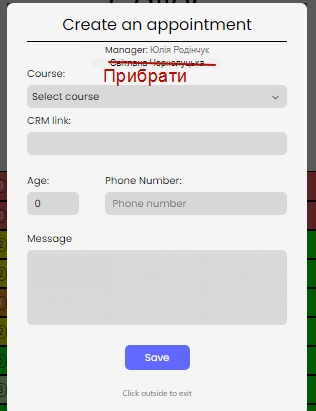
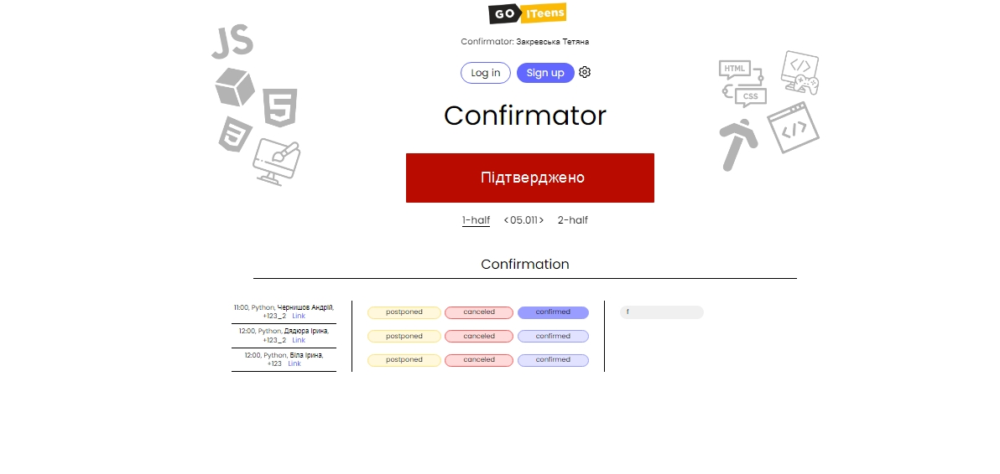
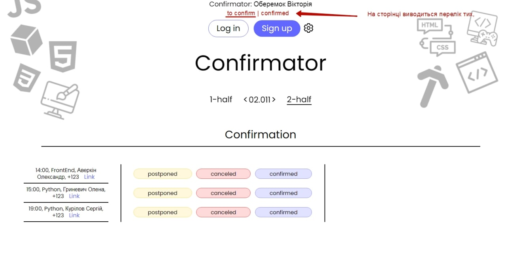

# Правки.
## Freemanagers

Всі хто вільний на даний час на тижні. А також можна обирати тих МІКів, які відображаються.  
Бек-енд:  
<a href = "https://goiteens-booking-system.herokuapp.com/avaliable_managers_list/14/6">https://goiteens-booking-system.herokuapp.com/avaliable_managers_list/14/6</a> 

## ManagersPostpone

Додати кнопку "Перенести" (Postpone) до форми інформації про консуьлтацію.  

Функціонал - аналогічний переносу у конфірматора.  

PUT /set_postpone_confirmation/{int:slot_id}/{int:appointment_id}  

## Cancelation

/set_cancel_confirmation/<int:slot_id>/<int:cancel_type>/<string:message>/

## NoList
  
Прибрати перелік вибору менеджеру.

## Information
  
При фіксації підтвердження, переносу, відміни - вспливає інформаційне вікно.

## Confirmed

  
/get_confirmed/<int:week_id>/<int:day>/<int:half>/

Додати пункт меню "Підтверджені", які відображають перелік всіх підтверджених консультацій.