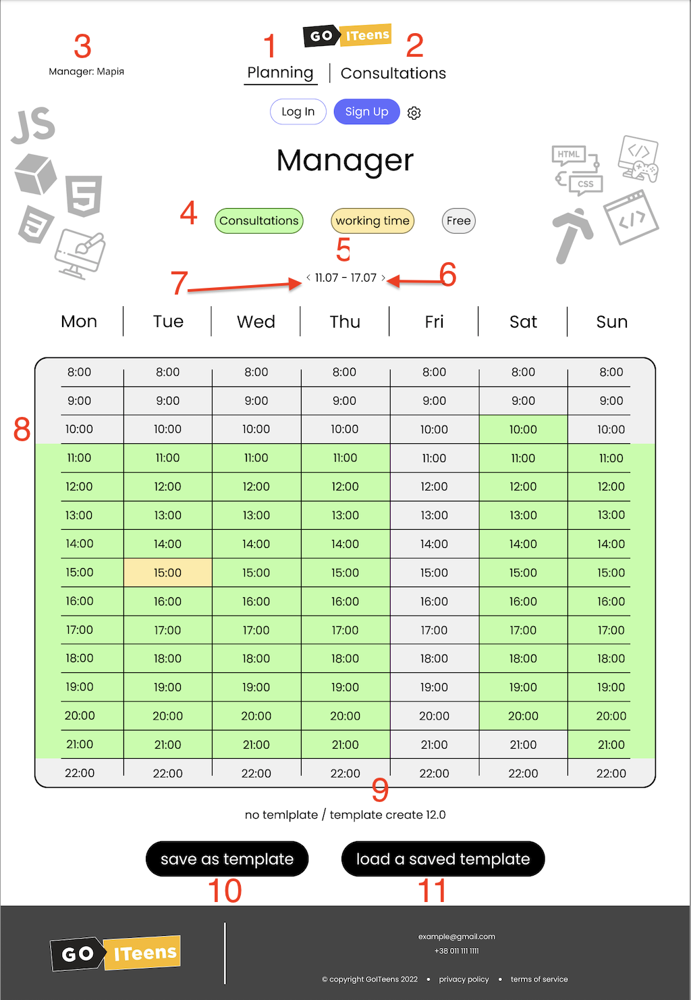

# Планування роботи менеджера

1. Пункт меню "Планування" (поточний) - сторінки за даним посиланням дозволяють відповідному менеджеру планувати власну діяльність.
2. Пункт меню "Консультації" - дозволяє менеджеру вести облік консультацій.
3. Вивід ролі та імені менеджера, що на даний момент працює зі сторінкою.
4. Активні кнопки, при натисканні на одну інші - "вимикаються" (принйип аналогічний RadioButton). Активна кнопка помічаєтсья границею (бордером). Тип активної кнопки визначає те, якій тип приймає ячійкав основному полі (8), по якій клікає користувач.
5. Тиждень із яким на даний момент працює користувач. За замовчуванням - дані отримаємо з бекенду.
6. При натисканні кнопка активним стає наступний тиждень.
7. При натисканні кнопка активним стає попередній тиждень.
8. Основне поле (комірки з 8:00 до 22:00 в 7 стовпчиках з понеділка по неділю). При натисканні на комірку вона отримує той тип, який відповідає активній кнопці в блоці 4.
9. Напис (один з двох), що відображає наявність збереженого шаблону саме для цього менеджера.
10. При натисканні кнопки графік поточного тижня зберігається як шаблон.
11. При натисканні кнопки графік, що збережений, завантажується і стає графіком активного тижня. (якщо немає збереженого графіку кноака 11 не активна).