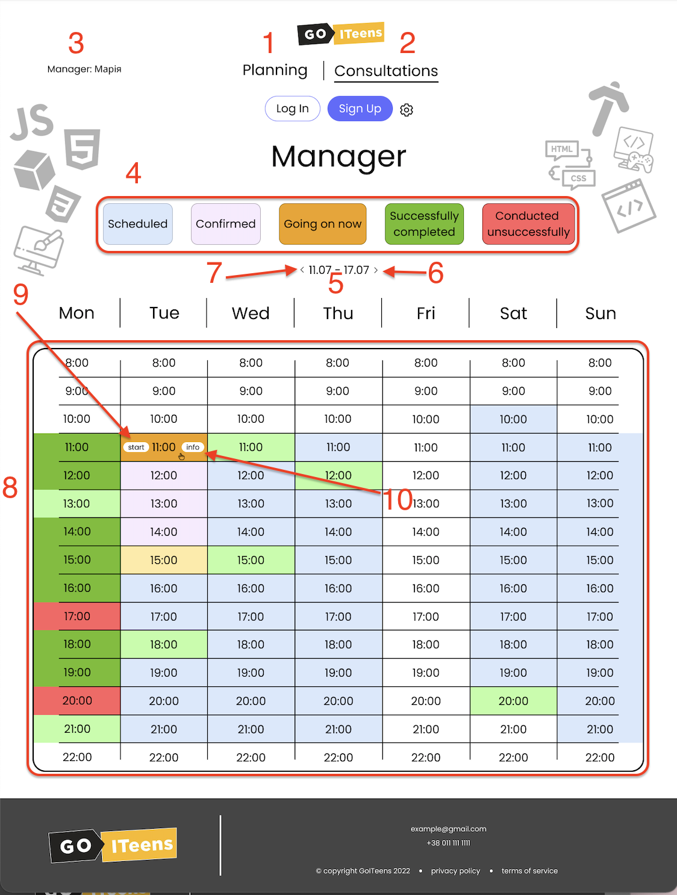

# Планування роботи менеджера

1. Пункт меню "Планування" (поточний) - сторінки за даним посиланням дозволяють відповідному менеджеру планувати власну діяльність.
2. Пункт меню "Консультації" - дозволяє менеджеру вести облік консультацій.
3. Вивід ролі та імені менеджера, що на даний момент працює зі сторінкою.
4. Індикативні блоки (не функціональні), відображають можливий стан елементів.
5. Тиждень із яким на даний момент працює користувач. За замовчуванням - дані отримаємо з бекенду.
6. При натисканні кнопка активним стає наступний тиждень.
7. При натисканні кнопка активним стає попередній тиждень.
8. Основне поле (комірки з 8:00 до 22:00 в 7 стовпчиках з понеділка по неділю). Значення при натисканні не змінює навідміну від сторінки планування.
9. Кнопка "Start" стає доступною тільки для поточних занять. При натисканні - стає неактивною.
10. Кнопка "Info" при натисканні - відкривається вспливающе вікно.
&nbsp;  
  
(!) комірки, які відповідають вже проведеним заняттям можуть бути змінені (при наведенні на комірку і натисканні - відкривається вікно, що аналогічно вікну при запису результату проведення консультації).