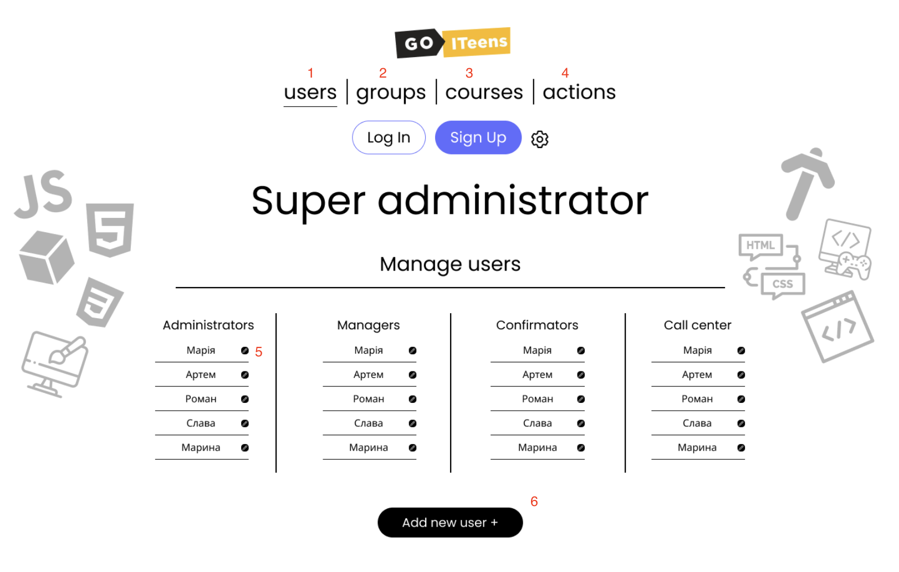

  

1. Пункт меню "Користувачі" (активний).
2. Пункт меню "Групи" - дозволяє створювати, та редагувати групи.
3. Пункт меню "Курси" - дозволяє створювати, та редагувати курсів.
4. Пункт меню "Дії" - дозволяє суперадміністратору корегувати дії всіх інших користувачів.
5. Кнопка редагування - тут та в аналогічних місцях при натисканні даної кнопки відкривається вспливаюче вікно  
  
&nbsp;

6. Кнопка створення нового користувача. При натисканні даної кнопки з'являється вспливаюче вікно створення нового користувача:

