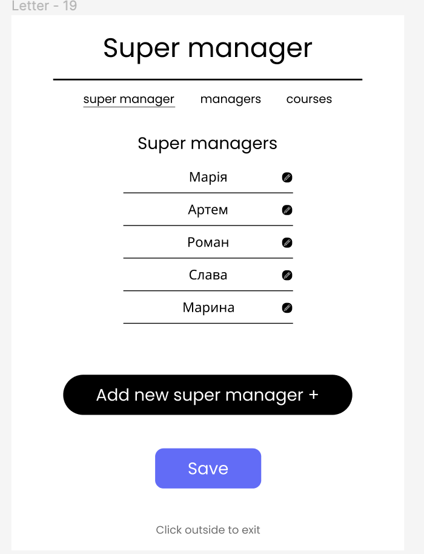
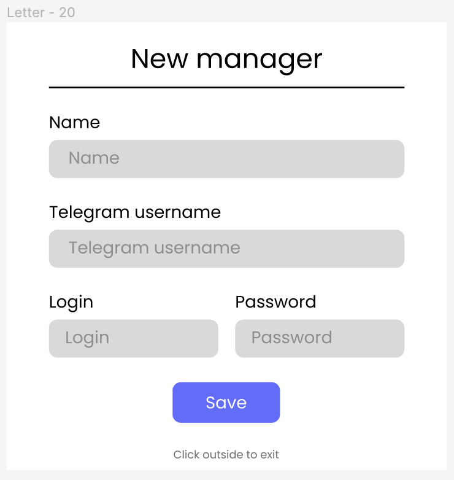
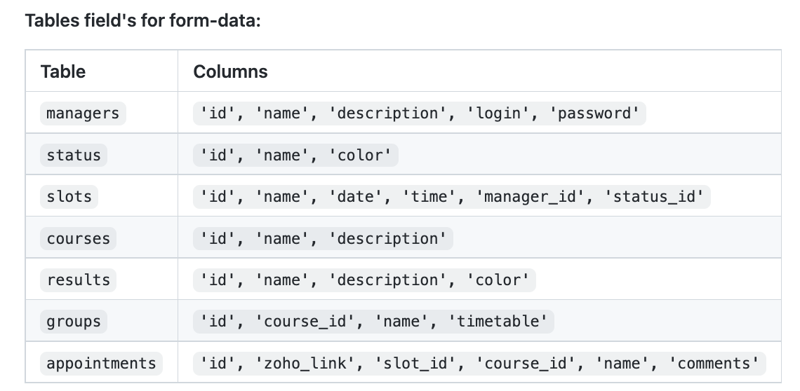
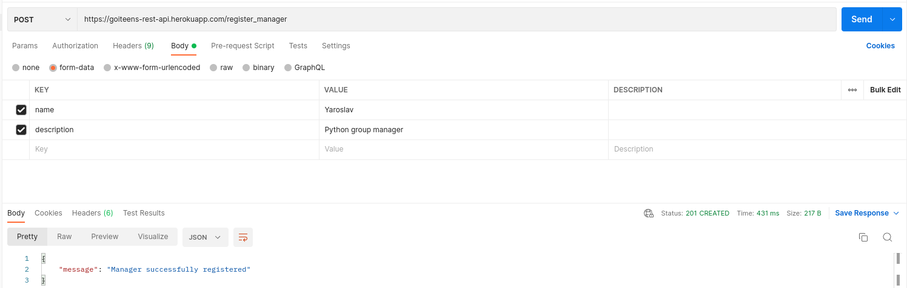

# Сторінка суперадміна
Сторіна суперадміна - це сторінка налаштувань системи. Суперадмін - це роль спеціаліста, який не приймає участі в операційному процесі консультації майбутніх студентів, проте він створює учасників процесу. На даний момент - є 4 ролі, які створює суперадміністратор із відповідними id: 1 - адміністратор, 2 - менеджер, 3 - колер, 4 - конфірматор.


## Створення облікових записів спеціалістів.




```POST /register_manager```






